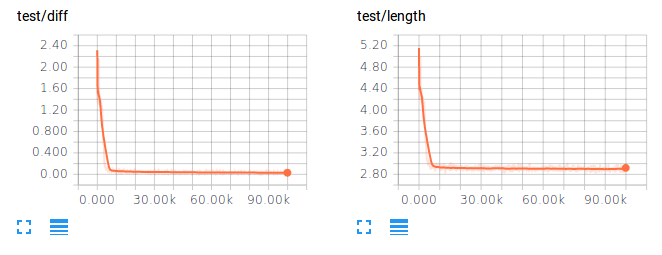
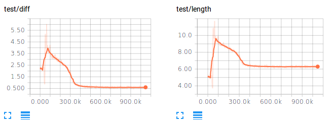

# reinforcement learning for tsp by pointer network

reference paper: [Neural Combinatorial Optimization with Reinforcement Learning](https://arxiv.org/abs/1611.09940)

For simiplity, we didn't implement then critic network, but use the optimial path length as the critic value instead.

The train tsp sample is generated by sampling 2D points uniformly in [0,1]*[0,1] grid. 
And the optimal solution is solved by [concorde](http://www.math.uwaterloo.ca/tsp/concorde.html). To generate the train sample, 
 `concorde` should be found in system's `PATH` variable.

## pre request
- requests
- tqdm
- numpy
- tensorflow 1.0

## run
```
python main.py --load_path=tsp_10 --data_length=10 --max_step=100000
python main.py --load_path=tsp_50 --data_length=50 --max_step=1000000
```

## result
tsp 10 test result after 100,000 its. The diff is the gap between rl solution and optimal solution. 



tsp 50 test result after 1000,000 its. The model is pretrained by tsp10 data for the first 50,000 iterations.

